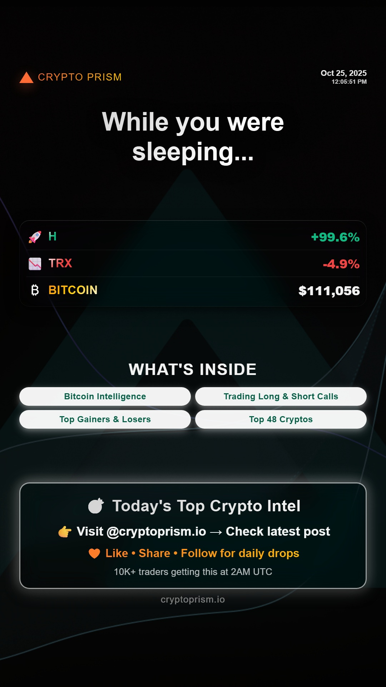
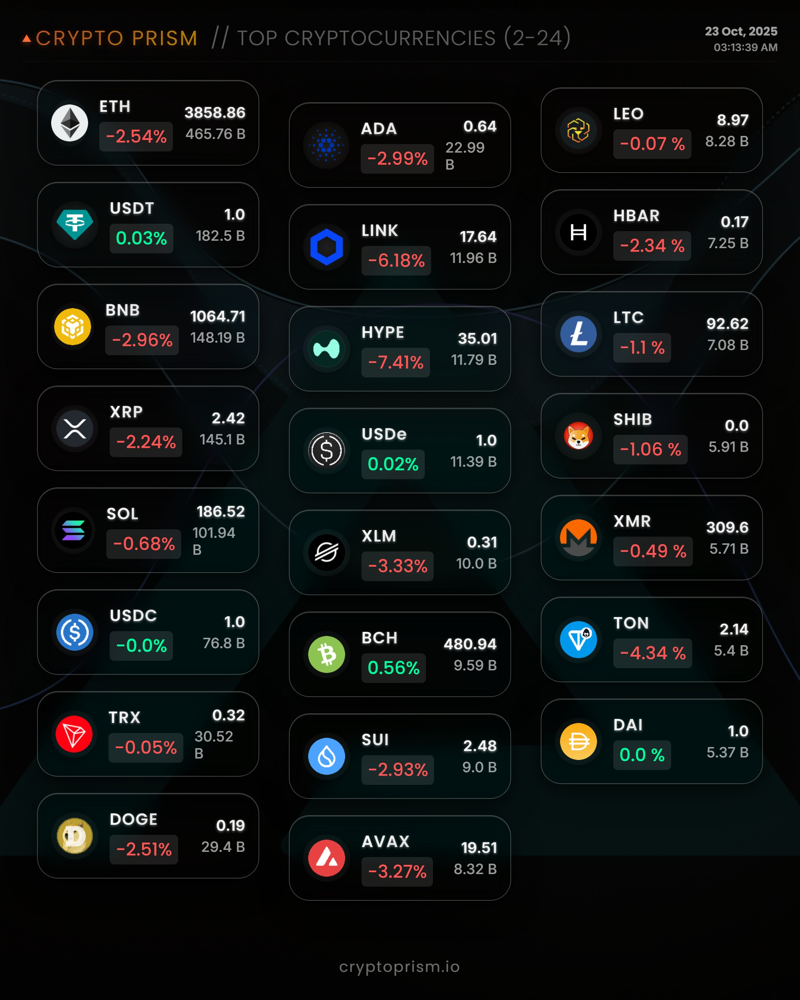
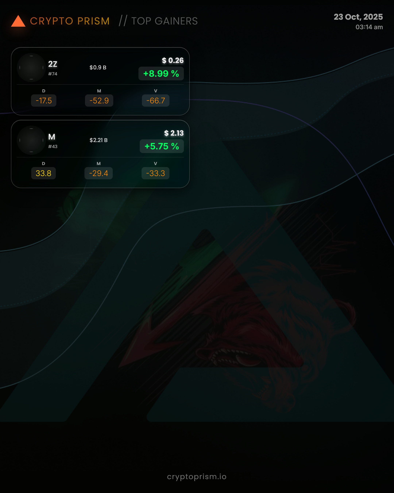
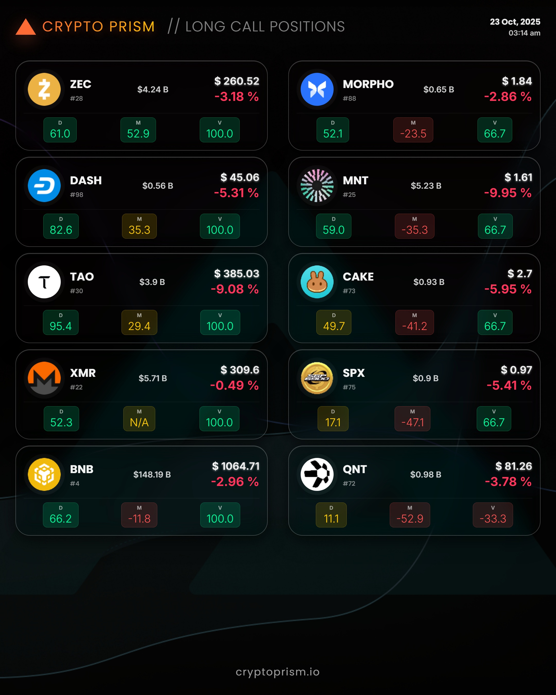

# Socials.io

<div align="center">

**Automated Social Media Content Generation & Publishing Platform**

[](CHANGELOG.md)
[](https://www.python.org/)
[](LICENSE)
[](https://instagram.com)

*Transform cryptocurrency data into engaging Instagram content through AI-powered automation*

[Features](#-key-features) • [Visual Showcase](#-visual-showcase) • [Quick Start](#-quick-start) • [Documentation](#-documentation)

</div>

---

## 📸 Visual Showcase

### Instagram Stories (1080x1920)
<div align="center">

| Story Teaser | Bitcoin Intelligence | Long Calls | Short Calls |
|:---:|:---:|:---:|:---:|
|  |  |  |  |
| **Daily Teaser** | **BTC + Fear & Greed** | **Bullish Setups** | **Bearish Opportunities** |

</div>

### Instagram Carousel Posts (1080x1080)
<div align="center">

| Cover | Top Cryptos | Gainers | Long Calls |
|:---:|:---:|:---:|:---:|
|  |  |  |  |

</div>

---

## ✨ What's New

### v2.6.4 (Current) - Documentation Revamp
- **Modern README** - Visual showcase with 8 embedded output images
- **Better Organization** - Streamlined structure, emoji headers, clear sections
- **Automation Schedule** - Complete timeline for 4 Stories + 3 Carousels

### v2.6.3 - Enhanced Visual Design
- **CTA Strategy Overhaul** - Multi-action CTAs driving LIKES, SHARES, FOLLOWS, and PAGE VISITS
- **Glassmorphic Design** - Modern dark glassmorphism across all stories and carousels
- **Fixed White Box Issue** - Proper background opacity and inset shadow removal
- **Local Server Fix** - CSS background images now load correctly in preview

### v2.5.0 - Instagram Stories Automation
- **4 Automated Stories** - Daily stories posted at 1-hour intervals (02:30, 03:30, 04:30, 05:30 UTC)
- **Story Teaser** - Engage viewers with daily crypto intel preview
- **Bitcoin Intelligence** - BTC price + Fear & Greed Index dual-axis chart
- **Trading Calls** - Long and Short position opportunities with DMV scores

### v2.4.0 - 3-Carousel System
- **Automated Daily Posts** - 3 distinct carousels at 02:00 UTC
- **AI-Generated Captions** - OpenRouter API (GPT-4o-mini) for each carousel
- **Smart Session Management** - 30-day persistence, rate-limiting protection

---

## 🎯 Key Features

### 📱 Multi-Format Content Generation
- **Instagram Stories** (1080x1920) - 4 automated daily stories
- **Instagram Carousels** (1080x1080) - 3-carousel posts with 14 slides total
- **HTML Templates** - 11 specialized templates with dedicated CSS
- **Glassmorphic Design** - Modern dark design with backdrop blur effects

### 🤖 AI-Powered Automation
- **OpenRouter Integration** - GPT-4o-mini for caption generation
- **Smart Captions** - 120-150 characters, 3-5 hashtags, engagement-optimized
- **L2 AI Filtering** - Web search + quality validation for market intelligence
- **Fallback System** - Default captions if AI generation fails

### 🔄 Automated Publishing
- **GitHub Actions** - Serverless automation on Ubuntu latest
- **4 Story Workflows** - Staggered posting every hour (02:30-05:30 UTC)
- **3-Carousel System** - Daily posts at 02:00 UTC with 5-min delays
- **Session Management** - 30-day persistent sessions, 7-day rate-limiting

### 📊 Data Pipeline
- **PostgreSQL Database** - Real-time cryptocurrency data
- **Google Sheets Sync** - Daily data synchronization
- **Playwright Screenshots** - HTML-to-image conversion (Chromium, Firefox, WebKit)
- **Template Engine** - Jinja2 dynamic rendering with live data

---

## 📅 Instagram Automation Schedule

### Daily Stories (4 Posts)
```
02:30 UTC - Story Teaser    (Engagement + Page Visit CTA)
03:30 UTC - Bitcoin Story    (BTC + Fear & Greed Index)
04:30 UTC - Long Calls       (Bullish Trading Opportunities)
05:30 UTC - Short Calls      (Bearish Trading Opportunities)
```

### Daily Carousels (3 Posts at 02:00 UTC)
```
Carousel 1: Bitcoin Intelligence + Top Cryptos
  └─ Slide 1: Bitcoin + Macro Intelligence (Template 6)
  └─ Slide 2: Top Cryptos 2-24 (Template 1)
  └─ Slide 3: Extended 25-48 (Template 2)

Carousel 2: Market Movers (5-min delay)
  └─ Slide 1: Top Gainers +2% (Template 3.1)
  └─ Slide 2: Top Losers -2% (Template 3.2)

Carousel 3: Trading Opportunities (5-min delay)
  └─ Slide 1: Long Call Positions (Template 4.1)
  └─ Slide 2: Short Call Positions (Template 4.2)
```

---

## 🚀 Quick Start

### 1. Installation
```bash
# Clone repository
git clone https://github.com/your-repo/socials.io.git
cd socials.io

# Install dependencies
pip install -r requirements.txt

# Install Playwright browsers
playwright install chromium
```

### 2. Environment Setup
Create `.env` file (use `.env.template` as reference):
```env
# Database
DB_HOST=your_postgresql_host
DB_NAME=dbcp
DB_USER=your_username
DB_PASSWORD=your_password

# AI Content Generation
OPENROUTER_API_KEY=your_openrouter_key

# Instagram
INSTAGRAM_USERNAME=your_instagram_username
INSTAGRAM_PASSWORD=your_instagram_password

# Google Cloud
GCP_CREDENTIALS={"type": "service_account", ...}
CRYPTO_SPREADSHEET_KEY=your_sheets_key
```

### 3. Create Instagram Session (CRITICAL)
```bash
python scripts/auth/create_instagram_session.py
# Creates data/instagram_session.json (30-day lifecycle)
```

### 4. Generate Content
```bash
# Generate individual story
python scripts/main/publishing/post_long_calls_story.py

# Generate all carousel templates
python scripts/main/individual_posts/generate_1_output.py
python scripts/main/individual_posts/generate_6_output.py

# Preview in browser
python scripts/dev/local_server.py
# Open http://localhost:8080/output_html/long_calls_story_output.html
```

### 5. Post to Instagram
```bash
# Post all 3 carousels (with AI captions)
python scripts/main/publishing/post_3_carousels.py

# Post individual stories
python scripts/main/publishing/post_story_teaser.py
python scripts/main/publishing/post_bitcoin_story.py
python scripts/main/publishing/post_long_calls_story.py
python scripts/main/publishing/post_short_calls_story.py
```

---

## 📁 Project Structure

```
socials.io/
├── 📁 scripts/                          # Python automation scripts
│   ├── 📁 main/
│   │   ├── 📁 individual_posts/         # Template generators (PRIMARY)
│   │   ├── 📁 publishing/               # Instagram posting & session management
│   │   ├── 📁 content/                  # AI generation & templating
│   │   ├── 📁 data/                     # Database operations
│   │   └── 📁 media/                    # Screenshot generation
│   ├── 📁 auth/                         # Authentication & sessions
│   ├── 📁 dev/                          # Development tools
│   └── 📁 setup/                        # System setup utilities
├── 📁 base_templates/                   # HTML templates + CSS stylesheets
│   ├── 📄 1.html → 7.html (+ splits 3_1, 3_2, 4_1, 4_2)
│   ├── 📄 bitcoin_story.html, trading_calls_story.html
│   ├── 📄 style1.css → style7.css
│   └── 📄 style_bitcoin_story.css, style_trading_calls_story.css
├── 📁 output_html/                      # Generated HTML + CSS
├── 📁 output_images/                    # Final JPG outputs (1080x1080, 1080x1920)
├── 📁 input_images/                     # Background images & assets
├── 📁 data/ & sessions/                 # Instagram session files
├── 📁 .github/workflows/                # GitHub Actions automation
│   ├── 📄 Instagram_Story_Teaser.yml    # 02:30 UTC
│   ├── 📄 Instagram_Story_Bitcoin.yml   # 03:30 UTC
│   ├── 📄 Instagram_Story_Long_Calls.yml # 04:30 UTC
│   ├── 📄 Instagram_Story_Short_Calls.yml # 05:30 UTC
│   └── 📄 Instagram_3_Carousels.yml     # 02:00 UTC (PRIMARY)
├── 📄 .env                              # Environment variables (DO NOT COMMIT)
├── 📄 requirements.txt                  # Core dependencies
├── 📄 CHANGELOG.md                      # Version history
└── 📄 CLAUDE.md                         # AI assistant guidance
```

---

## 🎨 Template System

### 11 Specialized Templates

| Template | Purpose | Format | Output |
|----------|---------|--------|--------|
| **Template 1** | Top Cryptocurrencies (2-24) | Carousel | Grid layout with coin data |
| **Template 2** | Extended Cryptos (25-48) | Carousel | Continuation grid |
| **Template 3.1** | Top Gainers (+2%) | Carousel | Performance highlights |
| **Template 3.2** | Top Losers (-2%) | Carousel | Performance highlights |
| **Template 4.1** | Long Call Positions | Carousel | Bullish opportunities |
| **Template 4.2** | Short Call Positions | Carousel | Bearish opportunities |
| **Template 6** | Bitcoin + Macro Intelligence | Carousel + Story | Fear & Greed + BTC dual-axis chart |
| **Story Teaser** | Daily engagement hook | Story | Glassmorphic stats showcase |
| **Bitcoin Story** | BTC intelligence | Story | Market sentiment + performance |
| **Long Calls Story** | Bullish setups | Story | Top 3 positions + DMV scores |
| **Short Calls Story** | Bearish setups | Story | Top 3 positions + DMV scores |

### Design Features
- **Glassmorphic Dark Theme** - Modern backdrop blur, subtle borders, gradient text
- **Auto-Layout Flexbox** - No absolute positioning, responsive by design
- **Instagram-Optimized** - 1080x1080 (carousel) and 1080x1920 (story) formats
- **Multi-Action CTAs** - Drive LIKES, SHARES, FOLLOWS, and PAGE VISITS
- **Typography** - Inter font family with gradient effects, no pure white
- **Color Semantics** - Green for bullish, red for bearish, orange brand accent

---

## 🔐 Instagram Session Management

### Why Sessions Matter
Instagram flags frequent username/password logins as suspicious, causing:
- Account security alerts and lockouts
- Two-factor authentication challenges
- Temporary account restrictions

### How It Works
1. **Create Once**: `python scripts/auth/create_instagram_session.py`
2. **30-Day Lifecycle**: Session stored in `data/instagram_session.json`
3. **Rate-Limited**: 7-day minimum between fresh logins
4. **Auto-Reuse**: All scripts use session instead of credentials

### Session Commands
```bash
# Create new session (do this ONCE initially)
python scripts/auth/create_instagram_session.py

# Check session health and age
python scripts/auth/instagram_session_status.py
```

**⚠️ NEVER login repeatedly with username/password. ALWAYS use session manager.**

---

## 🤖 AI Content Generation

### OpenRouter Integration
- **Model**: `openai/gpt-4o-mini` (cost-effective GPT-4 tier)
- **Caption Length**: 120-150 characters
- **Hashtags**: 3-5 relevant tags per post
- **Emojis**: 1-2 contextual emojis for engagement
- **Fallback**: Default captions if API fails

### Caption Prompts
```python
# Example: Bitcoin Intelligence Carousel
"Professional market analysis caption for Bitcoin Intelligence post.
Include Fear & Greed Index mention, top cryptos preview.
120-150 chars, 3-5 hashtags, 1-2 emojis."

# Example: Long Calls Story
"Energetic caption for bullish trading setups story.
Highlight top 3 coins with DMV scores.
120-150 chars, trading-focused hashtags, rocket emoji."
```

---

## 📊 Technology Stack

| Component | Technology | Purpose |
|-----------|------------|---------|
| **Web Automation** | Playwright (async) | HTML screenshot generation |
| **AI Content** | OpenRouter API | GPT-4o-mini for captions |
| **Instagram API** | instagrapi ~2.1 | Carousel & story posting |
| **Template Engine** | Jinja2 ~3.1 | Dynamic HTML rendering |
| **Database** | PostgreSQL + SQLAlchemy | Data storage & queries |
| **Image Processing** | Pillow ~10.1 | Image optimization |
| **Google Services** | gspread, Drive/Sheets API | Cloud data integration |
| **CI/CD** | GitHub Actions | Serverless automation |

---

## 🔄 GitHub Actions Workflows

### Active Workflows

#### Primary: Instagram 3-Carousels (Daily 02:00 UTC)
- **File**: `.github/workflows/Instagram_3_Carousels.yml`
- **Generates**: 7 templates (1, 2, 3.1, 3.2, 4.1, 4.2, 6)
- **Posts**: 3 carousels with AI captions, 5-min delays
- **Environment**: Python 3.11, Playwright Chromium

#### Stories: 4 Separate Workflows (02:30-05:30 UTC)
- **Instagram_Story_Teaser.yml** - 02:30 UTC
- **Instagram_Story_Bitcoin.yml** - 03:30 UTC
- **Instagram_Story_Long_Calls.yml** - 04:30 UTC
- **Instagram_Story_Short_Calls.yml** - 05:30 UTC

#### Secondary Workflows
- **gsheets.yml** - PostgreSQL → Google Sheets sync (00:31 UTC)
- **figma.yml** - Manual trigger for Figma integration

### Workflow Features
- Sequential dependencies (data sync → generation → publishing)
- Comprehensive error handling and retry logic
- Session persistence to avoid login issues
- Rate limiting with 5-minute delays
- GitHub Secrets for credential security

---

## 🛠️ Development Tools

### Local Preview Server
```bash
python scripts/dev/local_server.py
# Serves from project root on http://localhost:8080
# CSS and background images load correctly
```

### Environment Validation
```bash
python scripts/dev/validate_env.py      # Check environment variables
python scripts/dev/validate_project.py  # Validate project structure
```

### Windows UTF-8 Setup
```bash
scripts/setup/setup_windows_utf8.bat    # Fix encoding issues on Windows
```

---

## 📈 Performance Metrics

### Content Generation
- **Template Rendering**: 1-10 seconds per template
- **Screenshot Generation**: 2-5 seconds per image (Playwright)
- **AI Caption Generation**: 1-3 seconds (OpenRouter API)
- **Total Pipeline**: ~2-3 minutes for all templates

### Publishing Success Rates
- **Story Posts**: 4 posts daily, 1-hour intervals
- **Carousel Posts**: 3 posts daily, 5-minute intervals
- **Session Stability**: 30-day lifecycle, minimal login issues
- **AI Caption Success**: 95%+ with fallback captions

---

## 🐛 Troubleshooting

### Common Issues

**Instagram Login 403 Error**
```bash
# Solution: Create fresh session
python scripts/auth/create_instagram_session.py
```

**CSS/Images Not Loading in Local Server**
```bash
# Solution: Server now serves from project root (fixed in v2.6.3)
python scripts/dev/local_server.py
```

**Playwright Browser Issues**
```bash
# Solution: Install browsers
playwright install chromium
```

**AI Caption 404 Error**
```bash
# Solution: Verify OpenRouter API key
# Model: openai/gpt-4o-mini
```

**UTF-8 Encoding Errors (Windows)**
```bash
# Solution: Run UTF-8 setup
scripts/setup/setup_windows_utf8.bat
```

---

## 📚 Documentation

- **[CHANGELOG.md](CHANGELOG.md)** - Version history and release notes
- **[CLAUDE.md](CLAUDE.md)** - AI assistant development guidance
- **[TODO.md](TODO.md)** - Production hardening roadmap
- **[docs/](docs/)** - Additional documentation and guides

---

## 🤝 Contributing

Contributions welcome for:
- Additional template designs and layouts
- Enhanced AI content generation prompts
- Performance optimizations
- New social media platform integrations
- Analytics and engagement tracking

---

## 📄 License

MIT License - See [LICENSE](LICENSE) file for details.

---

## ⚠️ Disclaimer

This system is for legitimate social media automation. Ensure compliance with Instagram's Terms of Service and API usage policies. Monitor posting frequency and engagement to maintain account standing.

---

<div align="center">

**Built with ❤️ for the crypto community**

[⬆ Back to Top](#socialsio)

</div>
